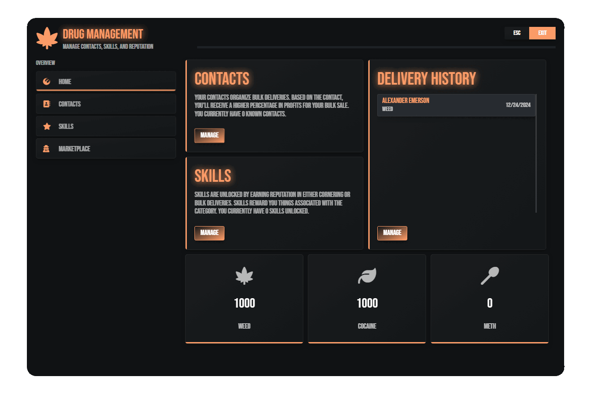

# Drug Sales & Market

Elevate your drug-selling gameplay with this immersive and dynamic script. Build your reputation in the criminal underworld, forge connections with key contacts, launder dirty money, and master the art of the trade through an engaging skill progression system. Experience realistic interactions, intense police encounters, a robust skill system that keeps you on the edge of your seat, and a player to player market. Whether you're looking to dominate the streets or rise to the top of the hierarchy, this script delivers a high-stakes, adrenaline-filled journey into the world of crime and profit.

<figure><figcaption></figcaption></figure>

## Main Features

***

* Optimized Resource (0.00ms idle, and 0.01 on use, less than 1 MiB ram usage regardless of frameworks) utilizing ox's classes system.
* Multi-Framework support (ESX, Ox, QBCore, QBox)
* Fully translatable (English translation included)
* Secure Netevents (Prevents cheaters from being able to exploit the system to gain free items)
* Drug Sale System
  * Negotiate every single offer when cornering.
  * Zone based selling.
    * Zones can accept specific drugs and items.
  * Ability to be robbed while cornering, with the ability to retrieve your items.
  * Configure the prop model per item during handoff.
  * Ability for police to speak with peds to reveal your name or further evidence.
  * Cop counts and cooldown system per handoff.
  * XP/ Rep rewards per handoff.
  * Utilizing the ped spawning native to make sure the block never goes dry.
* Contact System/ Deliveries
  * Meet new contacts by reaching a specific reputation level.
  * Contacts provide bulk delivery missions with item specific to each delivery.
  * Transport drugs to multiple stops along a single route.
  * Unlimited amount of contacts, create new contacts seamlessly.
  * Set specific routes per contact
  * XP/ Rep rewards per handoff.
  * Cooldown system per contact
* Skills
  * Tie the system together to make it feel rewarding for your players.
  * Unlimited amount of skills, create new skills seamlessly.
  * Skills provide rewards for players as they continue to gain reputation such as items, reputation, and cash.
  * Skills can be referenced in your other resources allowing you to tie this reputation system elsewhere. (See examples on our docs).
* Marketplace
  * A dynamic player to player digital market
  * Allow players to create offers for their items with the ability to whitelist/ blacklist specific items acceptable for the market, and set the maximum price for the item allowed.
  * History system allowing players to reference past sales/ purchases
  * Offers and history expires, ensuring your database doesn't get overloaded.
* Extensive config with in depth control of absolutely everything. Config comes with 2 Contacts made, 100+ locations, 20 skills per specialization (Weed, Cocaine) and more.&#x20;
* Integrated Police Alert system (pd-dispatch) out the box
* Tied with a interactive UI allowing your players to engage with this system on the fly.
* Multi theme allowing you to select which style you like

## Dependencies

***

* [Ox Lib](https://github.com/overextended/ox_lib/releases)
* [Ox Inventory](https://github.com/overextended/ox_inventory/releases)
* [Ox Target](https://github.com/overextended/ox_target)
* [Renewed Lib](https://github.com/Renewed-Scripts/Renewed-Lib)

## Lines of Code


3500 (8500+ including ui, config and locales)

